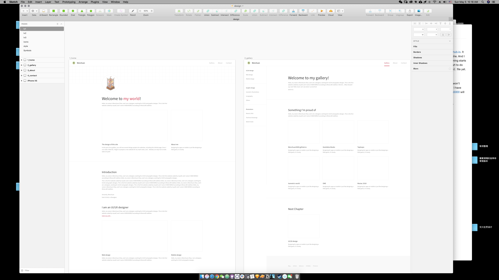

# Saturday, May 4, 2019

I think I should write a blog to record how I design and code my first site, the [wenchuan5000.github.io][wenchuan5000]. It is an idea inspired by Dr. Grace Augustine in Avatar the movie. "It keeps your mind clear." says she. And I think that might be a good idea to show people, how a designer with less knowledge on programing starts to code his first web site, such that other people like me might be encouraged. I should have start to do this 2 weeks ago, because that is the freshest time that I didn't even know how to create a `.html` file yet.

> All skill I need on coding is learned from [w3school](https://www.w3schools.com/).

I guess, the first polled out version of this site will be coded in a very "ancient" way. It means, It won't have any componentized elements, because I don't have tome to learn JavaScript yet (although I have used some); and it won't have any background progress. Yes, I mean, all contents on [Wenchuan5000] will be straightly written on the page, temporarily.

Until today, I have designed layouts for some basic pages, Home, Gallery and About, on Sketch. And I have written some forms of responsiveness for what I need, during designing, including a responsive `side-nav`. It was a total different experience compared to what I had done for years as an UI designer who can't code. It does keep my mind clear on how pages behave.



Also, I have designed the roughest version of my stylesheet of fonts and colors, and the width of the `div` contains my articles. This is my favorite process during working, because I want to build a site for mathematics notes of my friends' and mine. So, although it might be useless this time, I added a piece of JavaScript in `head` to show LaTeX math equations:

```javascript
<script type="text/x-mathjax-config">
  // begin added: The MathJax was too bold, so I add this, change default scale value 100 to 93;
  MathJax.Hub.Config({
      extensions: ["tex2jax.js"],
      "HTML-CSS": { scale: 93}
    });
  // end added
  MathJax.Hub.Config({
    tex2jax: {
      inlineMath: [ ['$','$'], ["\\(","\\)"] ],
      processEscapes: true
    }
  });
</script>
<script src="https://cdn.mathjax.org/mathjax/latest/MathJax.js?config=TeX-AMS-MML_HTMLorMML" type="text/javascript"></script>

```


[wenchuan5000]: https://wenchuan5000.github.io/
