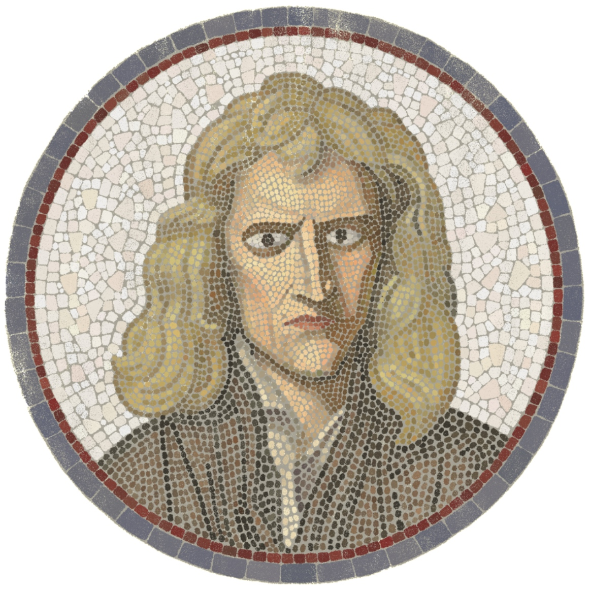

 
 
 
 

# Resumé of a UI/UX Designer 📐

<b>Zhao Wenchuan</b>, Shanghai, 2019
 
📧 wenchuanthesharpchin@gmail.com

 
 

**[Basic info]**

**[Education]**

**[Work experience]**

**[Career Plan]**

**[Projects]**

**[Art works]**

 

[Basic info]: #BasicInfo
[Education]: #Education
[Career Plan]: #CareerPlan
[Work experience]: #WorkExperience
[Projects]: #Projects
[Art works]: #ArtWorks

[Education in Art Acadamy]: #EducationInArtAcadamy
[Language]: #Language
[Education on Math]: #EducationOnMath

 

## Preface 🏯

 

Although what I am looking for is position of UI/UX designer, but, still, I want to put a welcome banner that shows my personal interest. This is a detail of my mosaic made on Photoshop. It describes my full desk. The Penguin book is History by Herodotus, which is one of my favorite books. The statue is brought from a shop near the temple of Zeus, Athens. And the interface show on the iPhone X is the first markdown editor I ever used called Bear. I haven't use it to write anything for years, because it doesn't support LaTeX syntax, but still, I like the beautiful interface and the smooth UX design.

 

Hi, my name is **Zhao Wenchuan** 👨, a 32 years old **UI/UX designer** 📐 and an **Illustrator** 🎨 from Shanghai. I have been working on **web**, **Android**, and **iOS** products for over 5 years. I am an energetic and passionate man, with thousands of ideas to make things useful and interesting, especially on the design for science recently. Until I have my first job as an UI designer 2015, I had been focus on technical drawings for many years, so I had a easy start on the interface design for websites or mobile applications, since the ability of arranging and control layouts is similar between technical drawing and UI design.

 

This is an interface design I choose from my personal repository. It is made for GeoGebra Books, recently. I made this because I like GeoGebra. It plays an important role in my math learning, but its UI/UX design (especially the UX in book editor) does not satisfy me at all. So I want to know what should I do if GeoGebra is a project of my own. But, to be honest, I have less confidence to send this to GeoGebra yet, because I think the Notion-like UX I used here is too difficulty to develop (as I tried once in the company TapTap for another project). But, still, I will go on this imaginary project, because it helps me aware of my thinking on a math book editor, as writing diary.

 

This project is called Taploop, a platform for sharing game experience. I did this in the company TapTap, as a UI/UX designer, and the product manager.

 

This is my technical drawing for Blackburn Monoplane (1914) made on Photoshop in 2012. I researched a lot from books and online images for this drawings. I really hoped there is an expert on industrial engineering who can help me...

 

> * If you are interested in my UI/UX project, please jump to [Work experience], or download .sketch files from my 🔗 [Githup];
> * If you are interested in my technical drawings, please visit my 🔗 [Pinterest].

 

In this resumé, I will share some experience to prove that **I can do excellent job on the design for science and online education**. It might be too long, but trust me, you will like it! Hope enjoy! 😊

 

 

## Basic info

 

* **First name**: Wenchuan

* **Last name**: Zhao

* **Apply for job**: UI/UX designer

* **Email**: wenchuanthesharpchin@gmail.com

* **City**: Shanghai

* **GitHub**: https://github.com/Wenchuan5000

* **Favorite artist**: Johann Sebastian Bach

* **Hobby**: Math

 

 

## Education 🏫

 

#### Education in Art Acadamy

* 2012 ~ 2015, [Shanghai Academy of Fine Arts], Master's Degree of Design

* 2005 ~ 2012, [Shanghai Academy of Fine Arts], Bachelor's Degree of Oil Painting

[Shanghai Academy of Fine Arts]: https://en.wikipedia.org/wiki/Shanghai_University_Fine_Arts_College

 

#### Language

I was born in Shanghai, so Chinese 🇨🇳 is my native language. I speaks Japanese 🇯🇵 because my parents do, as our second language. English 🇬🇧 is also a second language to me, but recently, it is my most commonly use language, because I learn math in English, and write notes for learning in full English --  because it could be more complicated if I tried to translate the vocabulary into Chinese.

 

 

#### Education on math

In the year 2018, when I was over 30, I don't even know anything about limits, derivative, or anything that a primary student should have known. But half years ago, I decided to make some changes for my ignorance.

 

My wife give me a compass as a present for celebrate my "growing up". As you may know, this is a lemma in Newton's <em>Principia</em>, describes the planetary movement around its sun.

 

My first text book is Euclid's *Element*. To be honest, I didn't read the whole book, but jump to analytic geometry for high school students, in the first month. After a few weeks, I started learning calculus on Khan Academy.

Recently, I started to real *Mathematical Analysis* written my Elias Zakon.

I learn math as as an Ancient Greek, well, I mean I treat every definition as geometric problem. This figure is the note for this definition: A number $A \in \mathbb R$ is called the limit of the numerical sequence $\{x_n\}$ if for all neighborhood $V(A)$ of $A$, there exists and index $N$ such that all terms of the sequence having index larger than $N$ belong to the neighborhood $V(A)$. In logic language:
$$
\left( \lim_{n\to \infty} x_n =A \right):= \forall V(A) \; \exists N\in \mathbb N \; \forall n > N \; \left(x_n \in V(A)\right).
$$

 

 

## Work experience (UI/UX Designer)

 

**[TapTap]**, Nov 2018 ~ Jan 2019

<!--Description-->

 

I worked in [TapTap] as the chief UI/UX Designer for a project called [Taploop], a platform for sharing ideas and experience of playing game. 

Please jump to [Projects] if you want to see more details.

 

**[Qianka]**, Mar 2017 ~ Mar 2018

<!--Description-->

 

I worked in [Qianka] as a senior UI/UX Designer. Thanks to my boss, I handled many projects. As you can see, the [Home Page][Qianka] of the company is work of mine. If you want to see more, please jump to [Projects].

Oh, by the way, most of the [icon works][My icon works] are made during I worked there.

 

**[ONE]**, Nov 2016 ~ Feb 2017

<!--Description-->

 

I worked in [ONE] as a chief UI/UX designer. [ONE · 一个][ONE] is an app for iOS and android for reading like Medium, but the Text editor in this app is not open to users, but only to ourself. You can click [here][ONE] to check it on App Store. Or you can jump to [Projects] for further details for the old version (the time of iPhone 7).

 

**[FangDD]**, Dec 2015 ~ Sep 2016

<!--Description-->

 

I worked in FangDD as a UI/UX designer. Please jump to [Projects] if you want to see more details.

 

**[Liulishuo]**, May 2015 ~ Nov 2015

I worked in Liulishuo as a junior UI/UX designer, and I think I did a bad job there, that is why I was fired at last...

 

## Career plan 🌒

 

#### Design for science and online education

The ideal job for me is designing for science 🧠 and online science education 🏫, as I have been focus on functional design for years.

 

I made this on GeoGebra Classical 6 for my artists friends, to introduce the basic idea of derivatives, beginning with the instantaneous change of time $\mathrm dt$ as a limit.

 

I very much like the figures in some math books which are "made of" LaTeX plots, and I am still looking for a better design principle for these things, to make people easier to understand math. And I am also haunted by the design of editor like [Atom](https://atom.io/), and dream that I can make one by myself in the future.

 
<!--pic-->

This is the math book editor I designed for GeoGebra Books (a personal imaginary project as I mentioned above). Personally, I'd rather use editor like Atom, or traditional Markdown editors like MWeb (With a left column to code and a right one to preview), but I was interested in the UX of Notion, so I tried this.

 

So, I think working with scientists^✏️ , designing for their works can help on the both way. I can do much better design for science than a normal designer can, because I love science, and I learn it continuously in daily life; on the other hand, I can learn much during the works. So I believe a designer like me is the best friend for scientists.

> ^✏️ I use the term "scientists" for all people working on research or teaching, in the subject as mathematics, computer science, or physics, etc..

 

The Portraits of Sir Issac Newton, Johannes Kepler and Nicolaus Copernicus. I paint these three portraits on Photoshop, in a sense of Mosaic. Becoming an scientist is a dream from my childhood.

 

I focus on online science education too, and I think it will do much better than a classroom does in the future. So, it is my career goal to seek answers for **making online education more than reading text online or watching video online**.

 

#### Make an online product for science education

Thus, I eagerly want to work with a team working on a project of online education for science, especially for math and computer science.

 

#### Make an online editor for scientific writing

I like editor, especially Markdown editors supporting LaTeX rendering. And, although I don't code yet, but the editors for coding like Atom also haunts me.

 

#### Write a math book (online version)

As I said above, I love education. So, once I think I can handle mathematical analysis, I will start to write a book of Mathematical Analysis by myself, introducing my geometric understanding in this subject, which shouldn't be as hard as people think.

[pic: the book .sketch]

I like paper books, but for science education, I think an online book with interactive elements (interactive graphs, notes and discussions, etc.) can be much better.

 

## Work experience

I have 5 years experience on UI/UX design in companies. I am proficient in UI develop tools as Sketch 👉 Zeplin, Photoshop, Illustrator, etc.. I don't code yet, but I know exactly how to work with engineers, and once an engineers gets my design files, he/she knows exactly what I mean.

My previous UI project is imaginary, called GeoGebra Books, as I have introduced before. Here is the link for the sketch files: [🧷 GeoGebra Books.sketch]().

Here, I give a list of my work experience below.

 

#### TapTap

Nov. 2018 ~ Jan 2019

This is my last job. I worked there for only 3 months, for a project called [Taploop](), as an UI/UX designer, and a product manager. [Taploop]() is a platform for sharing game experience. I took this project because I love games (eg. Skyrim, Minecraft, Braids).

Thanks for the teammates, although the investors divested at last, I still had a happy time of hard working with you guys.

Here is the project files:

* [Taploop]()
* [Taploop Editor]()

---

### **[Qianka.com](https://www.qianka.com/)**

Mar. 2017 ~ Mar. 2018

I worked there as an UI/UX designer in Qianka. The [homepage](https://www.qianka.com/) you see here is a work of mine, completed during the first 2 months I entered the company. Besides of this homepage, I also made a lot of things there.

#### [e.qianka.com](https://e.qianka.com/)

This is a management tool for the business between company and users. You can click [here](https://e.qianka.com/) to see the online version, or click [here]() to download the .sketch files.
 

#### [Bilu]()

Bilu was designed for a platform of sharing game experience. It was online for several month during 2017, and was closed soon. You can click [here]() to download the .sketch files.

#### [Qianka for iPhone](https://www.qianka.com/)

This is the main project of the company Qianka, you can get online version by entering https://www.qianka.com from Safari on iPhone, or just scan the QR-code from the last page of [Qianka.com](https://www.qianka.com/).

Further, I attached .sketch file [here]().

But, I need to notice here: I am not the only one handle this project, but with the teammates, Goolei, Xin Lihua, and Tongpeipei. I love them.

#### [Some graphic design for Design Team]()

In this company, I made a lot of graphic design for my team. I am so glad that my teammates like my little illustration so much, so I was working on them once I had spare time during the work time.

Here is the link for the .sketch files:

[Graph for my friends]()

---

### [ONE](https://itunes.apple.com/cn/app/one-%E4%B8%80%E4%B8%AA-%E6%96%87%E8%89%BA%E7%94%9F%E6%B4%BB%E9%98%85%E8%AF%BB%E5%BA%94%E7%94%A8/id539190656?mt=8)

Nov. 2016 ~ Feb. 2017

I worked in ONE as UI/UX design manager.

ONE is a reading app, sharing some warm article written by some local author. You can click [here](https://itunes.apple.com/cn/app/one-%E4%B8%80%E4%B8%AA-%E6%96%87%E8%89%BA%E7%94%9F%E6%B4%BB%E9%98%85%E8%AF%BB%E5%BA%94%E7%94%A8/id539190656?mt=8) for further details on App Sotre, or click [here]() for the .sketch files of ver. 4.1.0.

---

### [FangDD](https://itunes.apple.com/cn/app/%E6%88%BF%E5%A4%9A%E5%A4%9A-%E4%B9%B0%E6%88%BF%E5%8D%96%E6%88%BF%E9%A6%96%E9%80%89%E4%BA%A4%E6%98%93%E5%B9%B3%E5%8F%B0/id843148930?l=en&mt=8)

Dec. 2015 ~ Sep. 2016

I worked in FangDD as an UI/UX designer.

FangDD is an app for house trading. You can click [here](https://itunes.apple.com/cn/app/%E6%88%BF%E5%A4%9A%E5%A4%9A-%E4%B9%B0%E6%88%BF%E5%8D%96%E6%88%BF%E9%A6%96%E9%80%89%E4%BA%A4%E6%98%93%E5%B9%B3%E5%8F%B0/id843148930?l=en&mt=8) for further details on App Store.

---

### [Liulishuo](https://www.liulishuo.com/)

May 2015 ~ Nov. 2015

I worked in Liulishuo as an UI/UX deisgner.

[Githup]: s

[Pinterest]: s

[Taploop]: #Taploop

[My icon works]: s

<!--Company Info-->

[TapTap]: https://www.taptap.com

[Qianka]: https://www.qianka.com

[ONE]: https://itunes.apple.com/cn/app/one-%E4%B8%80%E4%B8%AA-%E6%96%87%E8%89%BA%E7%94%9F%E6%B4%BB%E9%98%85%E8%AF%BB%E5%BA%94%E7%94%A8/id539190656?mt=8

[FangDD]: https://itunes.apple.com/cn/app/%E6%88%BF%E5%A4%9A%E5%A4%9A-%E4%B9%B0%E6%88%BF%E5%8D%96%E6%88%BF%E9%A6%96%E9%80%89%E4%BA%A4%E6%98%93%E5%B9%B3%E5%8F%B0/id843148930?l=en&mt=8

[Liulishuo]: https://www.liulishuo.com/